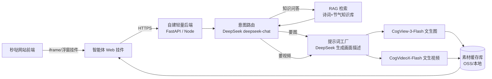

# 传统文化智能体 · 详细规划方案

> 目标网站：https://app-c2zk70llophd.appmiaoda.com （百度秒哒搭建的「二十四节气歌」主题站）
> 目标：为网站配一个专属的传统文化智能体，能对话讲解节气/诗词，并**依据场景自动生成对应的图片和视频**。

---

## ⚡ v2 修订（拿到网站源码后的重大更新）

拿到源码后发现站点是**秒哒导出的 React + TypeScript + Vite + Supabase 完整工程**，且已具备一整套 AI 云函数（走秒哒 API 网关）：文心对话、MiniMax 文生图、可灵图生视频、MiniMax 语音合成。这推翻了 v1 的两个假设：

| v1 假设 | 实际情况 | 结论 |
|---|---|---|
| 需要另建 FastAPI 后端保护 Key | 项目自带 Supabase Edge Functions，Key 存在 Supabase 环境变量里 | **不需要独立后端**，新增一个 `deepseek-chat` Edge Function 即可 |
| 生图/生视频需要接智谱免费模型 | 已有 MiniMax 文生图 + 可灵图生视频云函数（秒哒网关计费） | **直接复用现有函数**；智谱免费模型降级为额度耗尽时的备选 |
| 挂件用 iframe 嵌入 | 源码可直接开发新页面 | 智能体做成**站内一级页面** `/culture`，出现在导航栏 |

**v2 已实现的代码**（在 `app-c2zk70llophd/` 目录中，已通过项目自带的 tsgo 类型检查与 biome lint）：

| 文件 | 说明 |
|---|---|
| `supabase/functions/deepseek-chat/index.ts` | 新增：DeepSeek 云函数，支持流式透传 + JSON 模式，需配置 `DEEPSEEK_API_KEY` |
| `src/data/poetryLibrary.ts` | 新增：20 首精选古诗知识库（原文锚定层），带主题标签、儿童导读、画面意象、关键词检索 |
| `src/services/cultureAgent.ts` | 新增：智能体服务——知识检索注入、流式对话、媒体意图识别、场景要素抽取（DeepSeek JSON 模式）、3 套画风模板、文生图、图生视频、任务轮询 |
| `src/pages/CultureAgentPage.tsx` | 新增：「知节 · AI文化伙伴」页面，对话 + 画风选择 + 图片/视频卡片 + AI 生成标识 |
| `src/routes.tsx` | 修改：注册 `/culture` 路由，导航自动出现「AI文化伙伴」 |

**上线前唯一要做的配置**：在 Supabase 项目（秒哒后台的 Supabase 集成）中添加环境变量 `DEEPSEEK_API_KEY`（去 platform.deepseek.com 注册，新账号送 500 万 token），并部署 `deepseek-chat` 云函数。

**场景生成管线（v2 实际实现）**：
用户说"把小暑的荷塘做成小视频" → 规则识别媒体意图 → DeepSeek（JSON 模式）抽取画面要素（场景/主体/光线/情绪/色调）→ 套用所选画风模板（水墨写意/国潮插画/儿童绘本）→ MiniMax 文生图 → 可灵图生视频（画面更可控的两段式路线）→ 每 5 秒轮询直到出片。

以下 v1 内容中，知识库分层、反信息污染三道闸、模板设计、成本、路线图、合规清单等思路依然有效，作为后续迭代参考保留；「独立 FastAPI 后端」「智谱模型接入」两节改为**备选方案**。

---

## 🌍 v3 修订：面向国际儿童 + 功能路线细化

### 3.1 定位变化：网站主要服务国际儿童，传播中华传统文化

这是比任何功能都优先的信息，影响所有设计决策：

1. **双语是刚需，不是加分项**（✅ 已实现）
   - 智能体支持三种模式：中文 / English / 双语对照，用户在页面右上角自选，选择会被记住；
   - 诗词知识库升级为**三重锚定**：原文 + 拼音 + 儿童友好英文意译，全部人工校准入库——拼音多音字（"斜"、"为"）和译文质量绝不能交给模型现场发挥，这正是你们说的"固定信息过滤、防幻觉"的落地；
   - 英文人设：Zhijie，被要求用世界儿童熟悉的事物打比方（冬至 ≈ "中国的感恩节晚餐夜"），并解释文化专有词（jiaozi = Chinese dumplings）；
   - 英文指令（draw / make a video of…）同样能触发生成管线。

2. **海外访问性能要实测**（⚠️ 待办）
   - 站点后端在 `backend.appmiaoda.com`、图片在百度云 CDN，海外延迟未知。建议用目标市场（美/欧/东南亚）的测速工具实测首屏与生图耗时；如慢，优先把预生成素材搬到海外可达的 CDN。
   - DeepSeek API 海外可用性良好，不受影响。

3. **儿童合规从"国内标准"升级为"国际标准"**（⚠️ 设计原则）
   - 美国 COPPA、欧盟 GDPR-K 对 13 岁以下儿童数据采集极严格：**智能体不要求登录、不收集真实姓名/年龄/位置**；
   - 当前"延时记忆"只存浏览器 localStorage（昵称、语言偏好、最近话题），数据不出设备，这是对儿童产品最安全的记忆形态；将来若上 Supabase 云端记忆，必须走匿名 ID + 家长同意流程。

### 3.2 功能优先级（按讨论确认）与实现状态

| 优先级 | 功能 | 状态 |
|---|---|---|
| P0 | 问答（双语） | ✅ 已实现 |
| P0 | 配画 | ✅ 已实现 |
| P0 | 短视频 | ✅ 已实现 |
| P0 | 知识库（锚定层） | ✅ 已实现（20 首三重锚定诗库 + 24 节气表） |
| P1 | 贺卡 | 规划中：配画管线 + 应景诗句 + 双语祝福合成，可下载分享 |
| P1 | 飞花令/诗词接龙 | 规划中：对话内已可玩简化版，正式版需库内校验答案 |
| P1 | 延时记忆 | ✅ 已实现第一步（本地画像：昵称/语言/最近话题，注入系统提示词） |
| P2 | 个性化学习方案 | 规划中：首次对话 3 个小问题（年龄段/中文水平/兴趣）→ 生成推荐路径 |
| P2 | 语音对话 | 规划中，见 3.3 |
| P2 | 内容自动更换 | 规划中：节气故事等按用户画像由 DeepSeek 个性化改写（幼儿版/学童版/英文版），结果缓存 |
| P3 | 户外节气任务 | 规划中，见 3.4 |
| P3 | 座机/电话互动 | 远期概念，见 3.3 |

### 3.3 语音对话路线

- **说给用户听（TTS）**：站内已有 MiniMax 语音合成云函数（`tts-minimax`，儿童音色调校现成），给智能体回复加一个"🔊 读给我听"按钮即可，成本最低、最先做；对国际儿童，中文诗句朗读 = 跟读学习功能，价值极高。
- **听用户说（ASR）**：先用浏览器免费的 Web Speech API（Chrome/Edge 支持中英文识别，零成本零后端），效果不够再换云端 ASR。
- **"打电话给智能体"**：网上看到的座机互动本质是 VoIP + 实时语音大模型（如火山/阿里的实时音频方案），成本和工程量高一个数量级，建议作为远期品牌活动（如"给节气爷爷打电话"）单独立项，不进主线。

### 3.4 户外节气任务 + 约束沙盒（防幻觉设计）

你们讨论的"智能体自己给出约束条件，再经过固定过滤筛选"可以这样落地：

1. **任务模板库（人工白名单）**：每个节气预置 3-5 个安全任务骨架，如"找一找：__（当季植物）"“拍一拍：__（天空/物候现象）”——骨架是人写的，防止智能体编造不存在的动植物或危险活动；
2. **智能体填空**：DeepSeek 按用户所在半球/气候带 + 当前节气，用 JSON 模式往骨架里填内容（要素必须来自节气表的 `visual_keywords`/物候字段——**只能从库内取值**）；
3. **过滤沙盒（固定规则，代码实现，不靠模型自觉）**：输出必须通过校验：字段完整性、值在白名单内、无敏感词、任务动词在允许清单（找/看/拍/画/数）内——任何一条不过就丢弃重来；
4. **国际化注意**：南北半球季节相反（澳洲小暑时是冬天），任务生成必须带半球参数，或改成"图片寻宝"这种不依赖实地气候的形式兜底。

这个"模板骨架（人写）→ 模型填空（限库内取值）→ 代码校验（固定规则）"三段式，就是你们要的通用防幻觉沙盒，后续贺卡、学习方案生成都复用同一套。

### 3.5 知识库扩展方向（地点/景观/人文地理）

在节气表和诗库之外增加第三张表 `culturalPlaces`：地点（西湖/庐山/苏州寒山寺…）↔ 关联诗词 ↔ 景观意象 ↔ 一句人文地理介绍（双语）。诗库中《望庐山瀑布》《晓出净慈寺》《枫桥夜泊》已天然带地点，先把这条关联做出来，就能支持"这首诗写的是中国哪里？"这类国际儿童最爱问的问题。

### 3.6 v3.1 增量（500 首底层知识库 + 朗读）

1. **底层诗词库扩容至 500 首**（`src/data/basePoetry.json` + `basePoetry.ts`）：
   - 选材：唐诗三百首全收（305）+ 宋词名家精选（149，含必收名篇清单：水调歌头/声声慢/如梦令/满江红/雨霖铃…）+ 元曲散曲精选（26，含天净沙·秋思、山坡羊·潼关怀古），加精选层 20 首合计 500；
   - 数据源：开源 chinese-poetry 数据库（公有领域），OpenCC 繁转简；已过滤杂剧唱段、超长篇目（儿童场景不适用）；
   - 拼音由 pypinyin 机器标注并打上 `pinyinAuto` 标记——系统提示词要求智能体引用底层库拼音时声明"个别多音字以老师讲解为准"，权威读音仍以精选层为准（分层防污染）；
   - 约 300KB，经 Vite 动态 import 自动分包懒加载，不影响首屏；
   - 检索并入 RAG：精选层命中优先，底层库补位，重复去重。
2. **「读给我听」按钮**（复用现成 `tts-minimax` 云函数，儿童音色）：每条智能体回复下方可点播/停止，同文本音频缓存复用，去 emoji/链接后朗读。
3. **效果演示网址**：界面与知识库真实数据的离线演示页已发布（见 README），供快速预览与分享；生产部署仍按 v2 步骤。

### 3.7 v3 已提交的代码变更

| 文件 | 变更 |
|---|---|
| `src/data/poetryLibrary.ts` | 20 首诗全部补齐拼音 + 儿童友好英文意译 + 英文标签/导读，检索支持英文输入 |
| `src/services/cultureAgent.ts` | 三种语言模式的系统提示词、本地用户画像（延时记忆）、英文媒体指令识别 |
| `src/pages/CultureAgentPage.tsx` | 语言切换（记住选择）、全套双语界面文案与推荐问题、双语生成进度提示 |

---

## 一、现状与需求解读

从现有网站和讨论记录中提炼出的核心诉求：

| 现状痛点 | 对应诉求 |
|---|---|
| 站内知识全靠人工逐条添加，储备太少 | 需要一个**平台级底层知识库**（如唐诗三百首、二十四节气全量数据） |
| 内容单薄，只有文字卡片 | 每首诗/每个节气要有**自动对齐的画面**（图片、视频） |
| 担心接入外部搜索会引入低质内容 | 知识库必须**自建、可控、经过筛选**，避免信息污染 |
| 图片视频不可能全部人工上传 | AI 依据用户需求和已有模板**自行查找/生成**，自动对齐排版 |

一句话概括：**做一个"懂节气、懂诗词、会配画面"的智能体，知识来自自建可控语料，画面来自 AI 按模板生成。**

---

## 二、核心选型结论（先说最重要的）

### 2.1 DeepSeek 的能力边界

- ✅ DeepSeek（deepseek-chat）擅长：中文对话、诗词赏析、知识问答、结构化输出（JSON）、意图理解。
- ❌ DeepSeek **不能生成图片，也不能生成视频**——它是纯文本模型。
- 💰 计费：新注册开发者账号赠送 **500 万 token 免费额度（30 天有效）**；之后按量计费，deepseek-chat 约 **$0.14/百万输入 token、$0.28/百万输出 token**（缓存命中输入低至 $0.0028/百万），对个人项目而言每月成本通常在几元人民币以内。

### 2.2 图片/视频生成：用智谱免费模型补齐

智谱 BigModel 开放平台提供一组**完全免费的 API 模型**，正好覆盖 DeepSeek 缺失的能力：

| 模型 | 能力 | 费用 | 用途 |
|---|---|---|---|
| **CogView-3-Flash** | 文生图，支持 1024×1024 / 768×1344 / 864×1152 等多分辨率 | **免费** | 诗词配图、节气场景图、贺卡背景 |
| **CogVideoX-Flash** | 文生视频 + 图生视频，最长 10 秒，最高 4K/60fps | **免费** | 节气氛围短片、诗词意境动画 |
| GLM-4-Flash | 文本对话 | 免费 | DeepSeek 的降级备用（额度耗尽/超时兜底） |
| GLM-4V-Flash | 图片理解 | 免费 | 校验生成图是否符合诗意（可选的质检环节） |
| Embedding-2/3 | 文本向量化 | 极低价 | 知识库检索（RAG） |

### 2.3 最终架构一句话

> **DeepSeek 当大脑（对话、赏析、意图路由、生成绘画提示词），智谱免费模型当画笔（出图、出视频），自建诗词/节气知识库当记忆（RAG 检索，杜绝信息污染）。**

---

## 三、总体架构



**为什么必须有一个自建后端（哪怕很小）：**

1. **API Key 绝不能放在前端**——放前端等于公开，任何人都能盗刷你的额度。后端做代理转发，Key 存在服务器环境变量里。
2. 秒哒是无代码平台，对自定义后端逻辑支持有限；把智能体做成**独立部署的挂件（iframe 嵌入或浮动聊天球）**，与秒哒站解耦，秒哒那边只需要加一段嵌入代码。
3. 后端还承担：限流防刷、生成结果缓存（同一首诗的配图只生成一次，之后直接复用）、内容审核钩子。

**后端部署建议（按省钱排序）：**
- 免费档：Cloudflare Workers / Vercel（注意国内访问速度）、或者秒哒同生态的百度云函数 CFC（有免费额度，国内快）。
- 稳妥档：一台最低配国内云服务器（阿里云/腾讯云轻量，约 ¥30-60/月），域名备案后体验最好。

---

## 四、智能体产品设计

### 4.1 人设

- **名字建议**：「知节」「诗语」「小满」（取自节气名，亲切且点题）之类。
- **人设**：一位温润博学的传统文化向导，说话有书卷气但不掉书袋，会主动结合"今天是什么节气"来开场。
- **开场白示例**：今天是 7 月 11 日，正值小暑。"倏忽温风至，因循小暑来。" 想听听小暑的习俗，还是让我为你画一幅小暑的画？

### 4.2 功能清单（按优先级）

| 优先级 | 功能 | 交互形式 | 依赖 |
|---|---|---|---|
| P0 | 节气/诗词问答与赏析 | 对话 | DeepSeek + RAG |
| P0 | 诗词场景配图（"给这首诗配张画"） | 对话内出图卡片 | DeepSeek 提示词 + CogView |
| P1 | 节气意境短视频（8-10 秒氛围片） | 对话内视频卡片 | CogVideoX |
| P1 | "今日节气"自动播报 | 打开挂件即推送 | 节气数据表 |
| P2 | 节气贺卡生成（图 + 应景诗句 + 祝福语，可保存分享） | 表单式引导 | CogView + DeepSeek |
| P2 | 飞花令 / 诗词接龙小游戏 | 对话 | DeepSeek + 知识库校验 |
| P3 | 图生视频：把站内已有静态配图动起来 | 按钮触发 | CogVideoX 图生视频 |

### 4.3 意图路由（智能体的"总开关"）

每条用户消息先经过一次 DeepSeek 的轻量分类调用，输出 JSON：

```json
{ "intent": "chat | poem_qa | gen_image | gen_video | greeting_card | game",
  "topic": "小暑", "poem": "《小暑六月节》", "style_hint": "水墨" }
```

- `chat / poem_qa` → 走 RAG 检索 + DeepSeek 回答；
- `gen_image / gen_video` → 走"提示词工厂"（见第六章）→ 调智谱模型；
- 路由本身用极短 prompt，几乎不耗 token。

---

## 五、知识库方案（解决"知识储备少 + 信息污染"）

### 5.1 语料来源（全部开源可控，一次性导入）

| 语料 | 来源 | 规模 |
|---|---|---|
| 中华古诗词全库 | GitHub 开源项目 `chinese-poetry/chinese-poetry`（最全中华古诗词数据库，JSON 格式） | 唐诗 5.5 万首、宋诗 26 万首、宋词 2.1 万首等 |
| 唐诗三百首（精选层） | 同上仓库内含标注 | 300+ 首，作为"优先展示层" |
| 二十四节气数据 | 自建结构化表：每个节气的日期规则、三候、习俗、饮食、农事、代表诗词 3-5 首、视觉意象关键词 | 24 条主记录 + 关联表 |
| 传统节日 | 自建：春节/元宵/清明/端午/七夕/中秋/重阳等 | ~10 条 |

> 关键做法：**分层**。全量诗词库用于检索兜底；"三百首 + 节气代表诗"作为**精选层**，赏析、配图优先从精选层出，保证质量稳定——这就是你们说的"避免信息污染"的落地方式：智能体只从这个白名单语料里引用原文，DeepSeek 负责组织语言，不负责凭记忆背诗（大模型背诗经常背错字）。

### 5.2 RAG 检索流程

1. 导入时：诗词按「题目+作者+正文+朝代+主题标签」切块，用智谱 Embedding-3（或硅基流动免费的 bge-m3）向量化，存入轻量向量库（**推荐 SQLite + sqlite-vec 或 Chroma**，几十万条完全够用，零运维）。
2. 查询时：用户问题 → 向量检索 top-5 + 关键词精确匹配（题目/作者/节气名）→ 拼入 DeepSeek 的上下文 → 生成回答。
3. **回答中的诗句原文一律来自检索结果，禁止模型自由发挥**（在 system prompt 里强制约束，并要求标注出处）。

### 5.3 反信息污染的三道闸

1. **闭环语料**：不接通用搜索引擎，只查自建库；
2. **原文锚定**：诗句必须逐字来自库内 JSON，模型只做白话赏析；
3. **审核钩子**：后端接入免费的文本审核（如百度内容安全或智谱自带的安全过滤），拦截生成内容中的意外输出。

---

## 六、场景化图片/视频生成 Pipeline（本方案的灵魂）

这是实现"自动对应的画面"的完整链路，分四步：

### 第 1 步：视觉要素抽取（DeepSeek）

把诗词/节气文本交给 DeepSeek，用固定 schema 抽取画面要素：

```json
{
  "scene": "夏日荷塘，暴雨初歇",
  "elements": ["荷叶", "雨珠", "蜻蜓", "远山"],
  "time_light": "黄昏，雨后金光",
  "mood": "清凉、静谧",
  "color_palette": "青绿、黛蓝、藕荷"
}
```

### 第 2 步：套用风格模板（模板库，人工精修一次，长期复用）

预置 4-6 套**站点统一视觉风格模板**，保证全站画面风格一致（这就是"依据已有模板、AI 自动对齐"）：

- 🖌 **水墨写意**：留白构图、宣纸质感、淡墨晕染 —— 适合诗词赏析配图
- 🎨 **工笔重彩**：绢本设色、勾线填彩 —— 适合节气主视觉
- 🏮 **国潮插画**：扁平色块、暖色调、现代感 —— 适合贺卡/分享图
- 🌫 **实景摄影风**：自然光、浅景深 —— 适合节气习俗/饮食
- 🎬 **视频专用**：慢镜头、单一主体缓动（视频模型对复杂运动不擅长，模板要克制）

模板 = 「风格前缀 + 要素槽位 + 质量后缀 + 负面约束」，示例见仓库 `prompts/scene_templates.md`。

### 第 3 步：调用生成

- 图片：CogView-3-Flash，按用途选分辨率（对话卡片 1024×1024，页面横幅 1344×768）。
- 视频：CogVideoX-Flash，文生视频 8-10 秒；或先出图再**图生视频**（画面更可控，推荐后者）。
- 免费模型生成速度较慢（视频可能要 1-3 分钟），前端要做**异步任务 + 轮询/进度动画**，体验上用"研墨中…铺纸中…落笔中…"这类文案化等待。

### 第 4 步：缓存与复用（省额度、提速度的关键）

- 以「诗词 ID + 模板 ID」为缓存键，同一首诗同一风格**只生成一次**，结果存 OSS/服务器磁盘；
- 二十四节气 × 6 模板 = 144 张主视觉，**可以在上线前离线批量预生成**，用户秒开；
- 唐诗三百首同理可预生成一轮水墨风配图（300 张，免费额度内完成）；
- 只有用户的个性化请求（自定义风格、贺卡文案）才实时生成。

---

## 七、与秒哒网站的集成方式

秒哒是无代码平台，推荐**低侵入**集成：

1. **浮动聊天球（首选）**：在秒哒站内添加一段自定义 HTML/嵌入组件，加载我们独立部署的 `widget.js`——右下角出现聊天球，点开是智能体面板。智能体系统完全独立演进，不受秒哒能力限制。
2. **iframe 整页嵌入**：在秒哒站新增"文化智能体"页面，iframe 指向我们部署的聊天页。实现最简单，先用它验证。
3. **内容回灌**：预生成的节气图/诗词图可以直接上传回秒哒站的素材库，替换现有人工上传的图片，让静态页面也吃到 AI 产能。

> 若秒哒当前版本不允许插入自定义脚本，则退回方案 2（iframe 页面）+ 方案 3（素材回灌），同样成立。

---

## 八、成本估算

| 项目 | 用量假设（月） | 费用 |
|---|---|---|
| DeepSeek 对话 | 3000 次对话 × 平均 2K token | 前 30 天免费额度内 ≈ ¥0；之后约 ¥3-8/月 |
| CogView-3-Flash 图片 | 不限（免费模型） | ¥0 |
| CogVideoX-Flash 视频 | 不限（免费模型，有并发限制） | ¥0 |
| Embedding 向量化 | 一次性 30 万条 + 日常查询 | < ¥5（一次性） |
| 服务器 | 轻量云主机或云函数 | ¥0-60/月 |
| **合计** | | **≈ ¥0-70/月** |

---

## 九、分期路线图

### M1（第 1-2 周）·「会说话」
- 部署后端代理（`examples/server.py` 可直接起步），接通 DeepSeek；
- 导入二十四节气结构化数据 + 唐诗三百首，跑通 RAG；
- iframe 聊天页嵌入秒哒站，上线节气/诗词问答。

### M2（第 3-4 周）·「会画画」
- 接通 CogView-3-Flash，上线"给诗配画"；
- 建 4 套风格模板，离线预生成 24 节气 × 水墨/国潮两套主视觉；
- 生成结果缓存 + 素材回灌秒哒站。

### M3（第 5-6 周）·「会拍片」
- 接通 CogVideoX-Flash：节气氛围短视频（图生视频路线）；
- 异步任务队列 + 前端等待体验打磨。

### M4（第 7-8 周）·「更精细」
- 节气贺卡生成器（图 + 诗 + 祝福语合成，可下载分享）；
- 飞花令小游戏；今日节气自动播报；
- 数据看板：热门提问、生成量、缓存命中率，反哺模板迭代。

---

## 十、风险与合规清单

1. **API Key 安全**：Key 只存后端环境变量；后端按 IP/会话限流（如每人每分钟 5 条、每天生成 10 张图）。
2. **AI 生成内容标识**：按 2025 年 9 月起施行的《人工智能生成合成内容标识办法》，AI 生成的图片/视频需带显式标识——在图片角落加"AI 生成"水印、视频片头/角标注明，一步到位。
3. **内容审核**：用户输入和模型输出都过一遍审核接口再展示（智谱接口自带基础安全过滤，建议再叠一层）。
4. **版权**：古诗词原文为公有领域，无版权风险；AI 生成图视频按平台协议可商用，但建议保留生成记录。
5. **可用性兜底**：DeepSeek 偶发高峰限流——后端做自动降级到 GLM-4-Flash（免费），用户无感。
6. **备案**：如用国内服务器 + 自有域名对外服务，需要 ICP 备案（秒哒域名本身已合规，仅自建后端域名需要处理；用云函数默认域名可暂时规避）。

---

## 十一、仓库内配套文件

| 文件 | 说明 |
|---|---|
| `prompts/system_prompt.md` | 智能体完整系统提示词（人设 + 原文锚定约束 + 路由规则） |
| `prompts/scene_templates.md` | 6 套场景生成风格模板 + 负面提示词 |
| `examples/server.py` | FastAPI 后端代理：/chat（DeepSeek+RAG 占位）、/image（CogView）、/video（CogVideoX），可直接部署 |
| `examples/widget.html` | 可嵌入秒哒站的浮动聊天挂件示例 |

---

## 参考来源

- DeepSeek 官方定价文档：https://api-docs.deepseek.com/quick_start/pricing/
- DeepSeek 免费额度说明：https://mydeepseekapi.com/blog/deepseek-api-free-tiers
- 智谱 CogView-3-Flash 官方文档（免费模型）：https://docs.bigmodel.cn/cn/guide/models/free/cogview-3-flash
- 智谱免费模型全家桶介绍：https://zhuanlan.zhihu.com/p/18400744416
- 智谱开放平台定价：https://bigmodel.cn/pricing
- 开源诗词数据库：https://github.com/chinese-poetry/chinese-poetry
